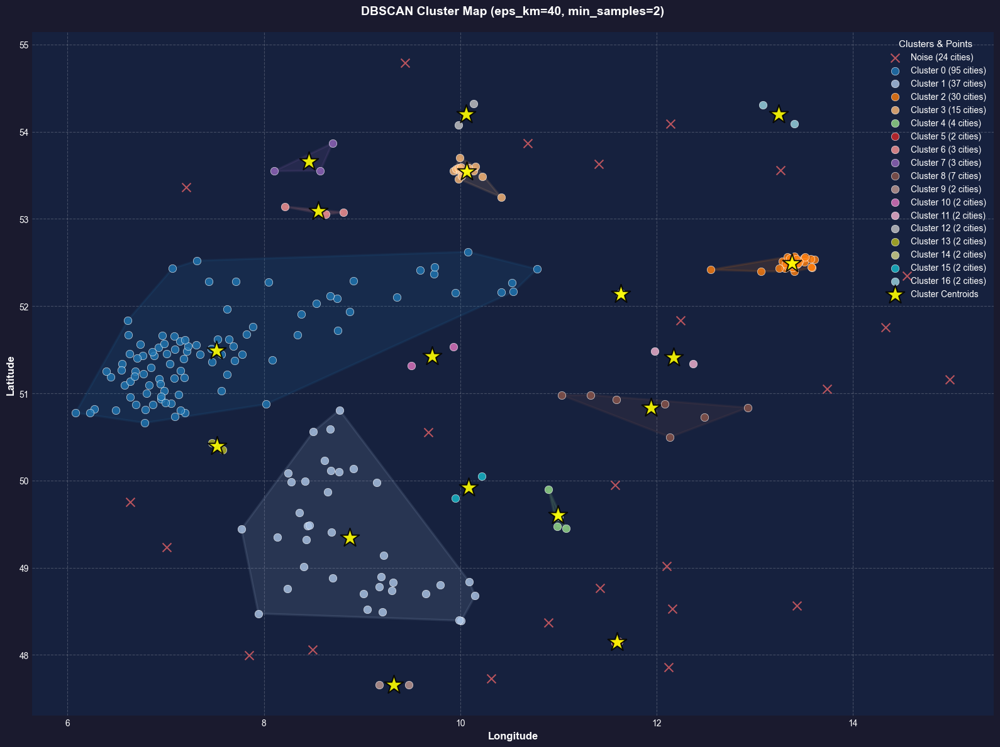
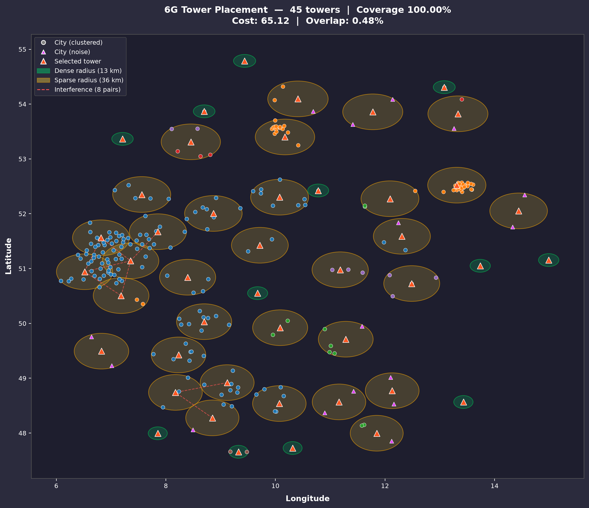
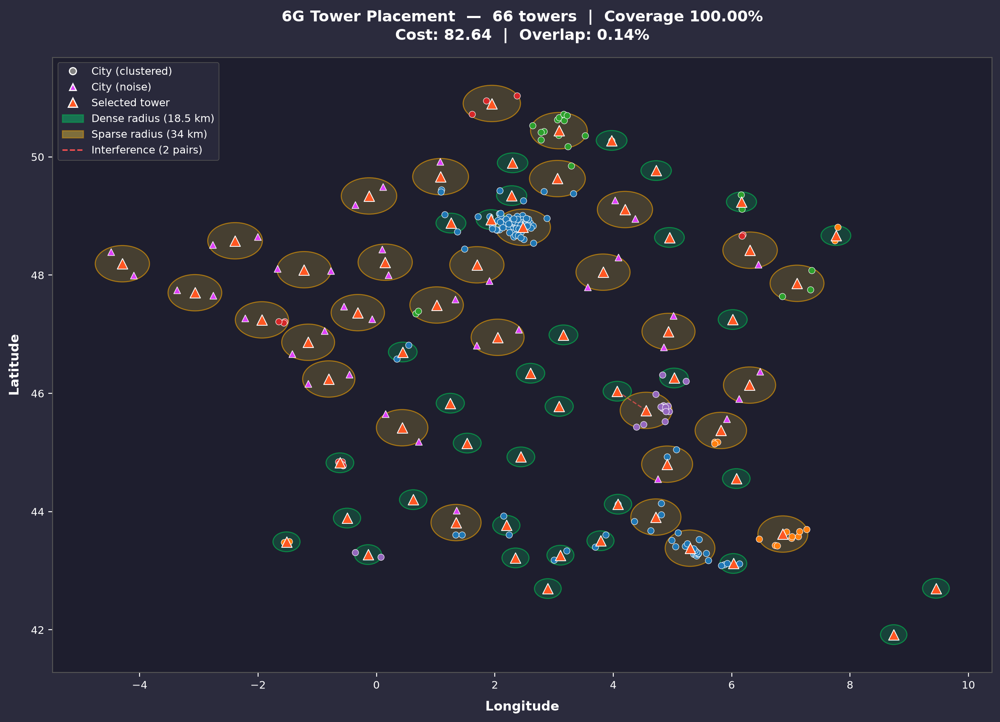
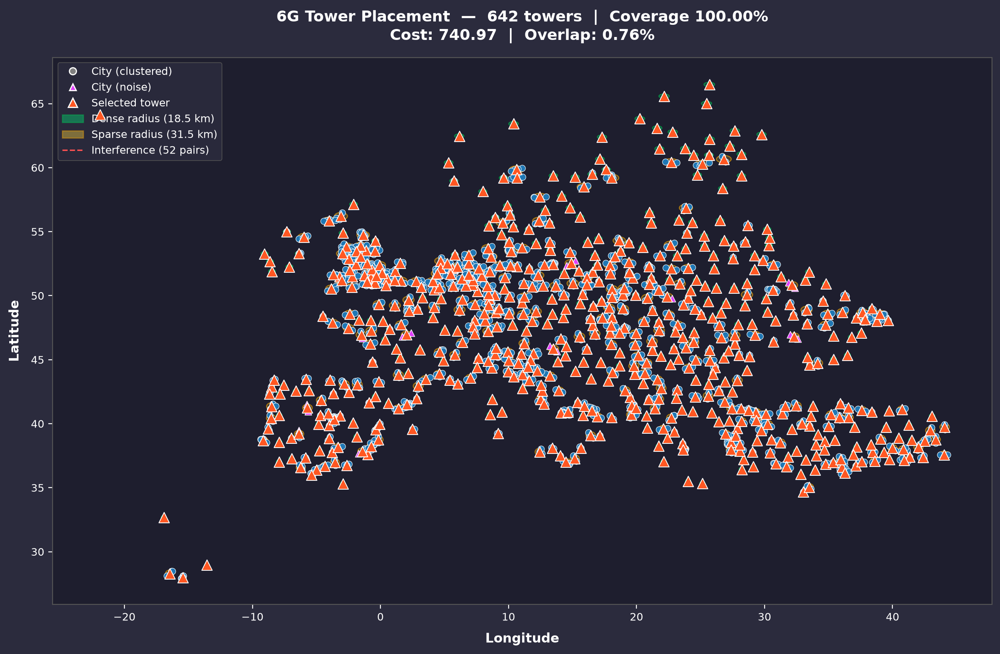
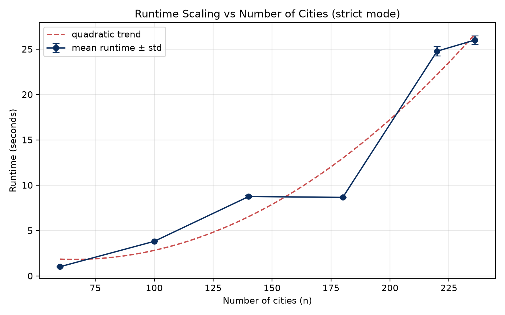

# 6G Tower Placement Optimizer

Mixed-integer linear program (MILP) for optimal placement of two-tier (dense/sparse) telecom towers with interference-aware objective.

## Quick start

```bash
python3 -m venv .venv
source .venv/bin/activate
pip install numpy pandas scipy scikit-learn pulp matplotlib
python run.py
```

## Project structure

```
├── run.py                  # CLI entry point + map visualization
├── data/
│   └── cities_de_50k.txt   # German cities >50k population
├── scripts/
│   ├── pareto_sweep.py     # ε-constraint Pareto front sweep
│   └── plot_pareto.py      # Render Pareto front from CSV
└── src/core/
    ├── __init__.py          # Public API exports
    ├── spatial.py           # Haversine distances, DBSCAN clustering, km projection
    ├── data.py              # City data loading
    ├── costs.py             # Piecewise-cubic tower cost function c(r)
    ├── candidates.py        # Candidate tower locations (cities, centroids, midpoints)
    ├── matrices.py          # Coverage matrix + interference pair builder
    ├── optimizer.py         # Weighted-sum & ε-constraint MILP (lazy pair generation)
    ├── radius_pair_search.py # Proxy-rank radius pairs → MILP verify best candidates
    ├── radius_search.py     # RadiusPlan dataclass
    ├── pareto.py            # Cost-vs-interference Pareto front computation
    └── pipeline.py          # End-to-end pipeline: load → cluster → optimize
```

## How it works

1. **Cluster cities** with DBSCAN (haversine metric).
2. **Generate candidate locations** — every city, cluster centroids, and midpoints between nearby cities.
3. **Search for the best radius pair** — proxy-rank all (dense, sparse) radius combinations with a greedy set-cover heuristic, then MILP-verify the top *k* candidates. An optional fine-grid refines the winning pair at 0.5 km resolution.
4. **Solve the MILP** — select towers minimizing α·cost + (1−α)·interference, subject to full coverage of all cities.

## Results

### DBSCAN clustering (ε = 40 km)

Cities are partitioned into dense clusters and noise points, which drives the two-tier (dense/sparse) radius strategy.



### Final tower placement

Selected towers with coverage circles (green = dense radius, yellow = sparse radius). Red dashed lines mark active interference between overlapping pairs.

**Germany** — 236 cities, ~50 towers


**France** — 30k+ cities (filtered), ~310 towers


**Europe** — 50k+ cities, ~680 towers


### Runtime scaling

Quadratic trend in practice — solver dominates with growing candidate and interference-pair counts.



## CLI reference

```
python run.py [OPTIONS]
```

| Flag | Default | Description |
|------|---------|-------------|
| `--cities` | auto | Path to cities file |
| `--eps-km` | 40.0 | DBSCAN epsilon (km) |
| `--min-samples` | 2 | DBSCAN min_samples |
| `--alpha` | 0.5 | Cost vs interference weight |
| `--radius-step` | 5.0 | Coarse radius step (km) |
| `--radius-milp-top-k` | 8 | Top proxy pairs to MILP-verify |
| `--radius-time-limit` | 20.0 | Time limit per radius-pair solve (s) |
| `--time-limit` | 60.0 | Final MILP time limit (s) |
| `--no-midpoints` | False | Disable midpoint candidates |
| `--midpoint-max-distance` | 80.0 | Max city distance for midpoint generation (km) |
| `--solver` | auto | Force `gurobi` or `cbc` |
| `--pareto` | False | Also trace the cost-vs-interference Pareto front |
| `--pareto-steps` | 20 | Number of ε steps for Pareto sweep |
| `--output` | — | Write selected towers to text file |
| `--plot-output` | images/vis.png | Map visualization path |
| `--no-plot` | False | Skip map visualization |

## Data format

The input is a CSV with no header: `city_name, latitude, longitude`.

## Solver notes

- **Gurobi** is auto-detected if installed (fastest). Obtain a free academic license at [gurobi.com](https://www.gurobi.com).
- **HiGHS** is bundled with PuLP and used as the default fallback.
- **CBC** can be forced with `--solver cbc` but is often slower.