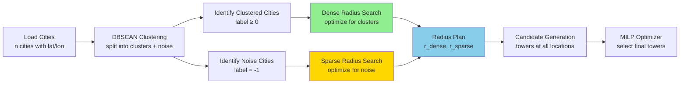

# Radius Selection for Type 1 and Type 2 Towers

**Quick Reference:**
- **Type 1 (Dense Tower)** = `dense_radius_km` — optimized for clustered city regions
- **Type 2 (Sparse Tower)** = `sparse_radius_km` — optimized for isolated cities

The radius planner **does not place towers**. It computes exactly two fixed radii that will be used later by the candidate generator and MILP optimizer.

## 1. Core Concept: Why Two Radii?

Imagine a map with cities distributed unevenly:

```
Scenario A: Dense cluster     Scenario B: Sparse outliers
●●●●●●                        ●
●●●●●●                                      ●
●●●●●●                                  
(10 cities in 10 km)               (3 cities spread over 100 km)
```

A single fixed radius is economically inefficient:
- **Small radius (e.g., 5 km)**: Efficient for dense areas, but requires many towers for sparse outliers
- **Large radius (e.g., 50 km)**: Covers sparse areas, but wastes money on large coverage in dense areas

**Solution:** Use two independent radii tuned for each spatial regime:
- Dense radius: covers clustered cities efficiently
- Sparse radius: covers isolated cities economically

## 2. Algorithm Pipeline



**Code path:** `core/pipeline.py` → `plan_tower_radii()` → `core/radius_search.py` → `core/candidates.py` → `core/optimizer.py`

## 3. Distance Model (Haversine)

All cities are geographic points on Earth's surface. Distances are computed using the **haversine formula**, which gives the great-circle distance between two latitude/longitude pairs.

**City representation:**
$$x_i = (\phi_i, \lambda_i) \quad \text{where } \phi_i \text{ is latitude, } \lambda_i \text{ is longitude}$$

**Haversine distance** between two cities:
$$d(x_i, x_j) = 2R \arcsin\left(\sqrt{\sin^2\left(\frac{\Delta\phi}{2}\right) + \cos(\phi_i)\cos(\phi_j)\sin^2\left(\frac{\Delta\lambda}{2}\right)}\right)$$

where:
- $\Delta\phi = \phi_j - \phi_i$ (latitude difference in radians)
- $\Delta\lambda = \lambda_j - \lambda_i$ (longitude difference in radians)
- $R = 6371.01$ km (Earth's mean radius)

**Why not Euclidean?** At this scale, Earth's curvature matters. Haversine gives accurate kilometer distances, not distorted degrees.

## 4. DBSCAN Clustering Split

Before radius planning, cities are clustered using **DBSCAN** (density-based spatial clustering).

**DBSCAN output:** Each city gets a label:
- Label $\ell_i \geq 0$: city is part of a dense cluster
- Label $\ell_i = -1$: city is isolated (noise)

This partitions the city set into two groups:

$$C_{\text{clustered}} = \{x_i : \ell_i \geq 0\}$$
$$C_{\text{noise}} = \{x_i : \ell_i = -1\}$$

**Visual example:**
```
Cluster 0        Cluster 1        Noise
●●●●●●          ●●●              ●
●●●●●●          ●●●              
●●●●●●          ●●●              ●

(18 cities)      (9 cities)       (2 cities)
```

The two searches use these groups separately because they serve different purposes:
- **Dense search** optimizes for clustered areas where many cities are close
- **Sparse search** optimizes for isolated areas where cities are far apart

## 5. Representative Points: Evaluation vs Placement

**Critical clarification:** Representative points are **NOT tower placement locations**. They are **evaluation points** used to measure average coverage efficiency.

Think of it this way:
- We're not placing towers at representatives
- We're asking: "If we place towers at various representative points, how many cities would each tower typically cover?"
- This tells us which radius is economical

### Dense Representative Set: $R_{\text{dense}}$

For clustered cities, we build a representative set as:

$$R_{\text{dense}} = \bigcup_{k} \left( \{\mu_k\} \cup S_k \right)$$

where:
- $k$ ranges over all clusters
- $\mu_k$ = centroid of cluster $k$
- $S_k$ = all individual cities in cluster $k$

**Why centroids + cities?** Because:
1. **Centroid** captures the "center of mass" of a cluster → represents optimal placement
2. **Individual cities** capture the scatter within clusters → shows variation from center

**Code example:**
```python
# Cluster 0 has cities at: [city_A, city_B, city_C]
centroid_0 = mean([city_A, city_B, city_C])
R_dense = [centroid_0, city_A, city_B, city_C, centroid_1, city_D, ...]
```

### Sparse Representative Set: $R_{\text{sparse}}$

For isolated cities, use only noise cities:

$$R_{\text{sparse}} = C_{\text{noise}} = \{x_i : \ell_i = -1\}$$

**Why only noise cities?** Because sparse towers should serve isolated areas, so the search must find a radius that economically covers these scattered, remote cities.

**Visual comparison:**
```
Dense Representatives          Sparse Representatives
●=city  *=centroid            ●=noise city only

Cluster 0:     Cluster 1:
*●●●●●         *●●            ●
●●●●●●         ●●●                    ●
●●●●●●         ●●●            
                               ●
(Dense: 16 reps)               (Sparse: 3 reps)
```

Two searches on different point sets → two different optimal radii.

## 6. Coverage Model: How Many Cities Would a Tower Cover?

For a candidate radius $r$, we measure **average coverage** by simulating towers at representative points.

**Step-by-step:**

1. **Compute distance matrix** between all representatives and ALL cities:
   $$D_{\text{matrix}}[i,j] = d(\text{rep}_i, c_j) \quad \text{for each representative } i \text{ and city } j$$

2. **For each representative point** $p$, count cities within radius $r$:
   $$\text{cov}(p, r) = \sum_{x \in C} \mathbf{1}[d(p, x) \leq r]$$
   
   where $\mathbf{1}[\cdot]$ is the indicator function (1 if true, 0 if false).

3. **Average across all representatives:**
   $$\bar{c}_R(r) = \frac{1}{|R|} \sum_{p \in R} \text{cov}(p, r)$$

**Interpretation:** $\bar{c}_R(r)$ = "on average, how many cities would each tower cover if placed at a representative point?"

**Concrete example:**
```
Representatives: [rep_0, rep_1, rep_2]
Cities: [c_0, c_1, c_2, c_3, c_4]
Radius: r = 25 km

Distance matrix:
           c_0    c_1    c_2    c_3    c_4
rep_0:    5 km   12 km  28 km  40 km  60 km    → covers {c_0, c_1}        → cov(rep_0) = 2
rep_1:   40 km   25 km   8 km  15 km  30 km    → covers {c_1, c_2, c_3}   → cov(rep_1) = 3
rep_2:   35 km   40 km  22 km  10 km  18 km    → covers {c_2, c_3, c_4}   → cov(rep_2) = 3

Average coverage: (2 + 3 + 3) / 3 = 2.67 cities per tower
```

**Why use average instead of total?** Because:
- If $R$ has 100 representatives and $R'$ has 10, using total would unfairly bias $R$
- Average normalizes: "per representative point, what's the typical coverage?"
- This makes the search fair between dense (many reps) and sparse (few reps) sets

## 7. Economic Objective: Cost Per Coverage Score

The planner minimizes a **cost-effectiveness score** that balances installation cost against coverage.

### Tower Cost Function

The real installation cost is a **piecewise cubic function** calibrated for 6G towers:

$$
\text{cost}(r) = \begin{cases}
0.0000390 r^3 - 0.000585 r^2 + 0.000818 r + 0.906 & \text{if } 5 \leq r \leq 20 \text{ km} \\
-0.0000468 r^3 + 0.00456 r^2 - 0.102 r + 1.592 & \text{if } 20 < r \leq 35 \text{ km} \\
0.0000593 r^3 - 0.00658 r^2 + 0.288 r - 2.957 & \text{if } 35 < r \leq 50 \text{ km} \\
-0.0000155 r^3 + 0.00463 r^2 - 0.273 r + 6.387 & \text{if } 50 < r \leq 100 \text{ km}
\end{cases}
$$

The cost curve has inflection points because different technologies are used for different coverage ranges.

### Selection Score

The **selection score** for a candidate radius $r$ is:

$$
J_R(r) = \frac{\text{cost}(r)}{\max(1.0, \bar{c}_R(r))}
$$

**Interpretation:**
- **Numerator:** Installation cost (higher = more expensive)
- **Denominator:** Average coverage per tower (higher = more efficient)
- **Lower score = better:** Cheap radius that covers many cities

**Example:**
```
Radius 20 km:  cost = 1.0,  avg_coverage = 4 cities  →  score = 1.0 / 4 = 0.25
Radius 30 km:  cost = 1.5,  avg_coverage = 6 cities  →  score = 1.5 / 6 = 0.25
Radius 40 km:  cost = 2.5,  avg_coverage = 8 cities  →  score = 2.5 / 8 = 0.31 ← worse

Optimal radius = 20 km or 30 km (both have best score of 0.25)
```

### Finding the Optimal Radius

$$r^* = \arg\min_{r \in [L, U]} J_R(r)$$

where $[L, U]$ is the search bounds computed from spatial statistics (see Section 8).

## 8. Radius Search Bounds: Where to Look

The planner doesn't search all possible radii [5, 100] km. It first estimates a reasonable interval based on spatial statistics.

### Why Bounds Matter

```
Too small bound (e.g., [5, 10])     Too large bound (e.g., [60, 100])
Bad: optimal radius is outside       Bad: wastes time evaluating
                                     radii that can never be optimal
Good: [15, 75] based on the data
```

### Computing Lower Bound

**Step 1:** For the relevant point set (clustered or noise), compute nearest-neighbor distances.

**Step 2:** Find the 10th percentile:
$$d_{10} = \text{percentile}(\text{nearest-neighbor distances}, 10)$$

The 10th percentile means: 90% of points have a neighbor closer than $d_{10}$.

**Step 3:** Lower bound is half this distance:
$$L = \max\left(5, \left\lfloor \frac{d_{10}}{2} \right\rfloor\right)$$

**Why?** If the nearest neighbor is 20 km away, a radius of 10 km is probably too small. A radius of 5 km would be wasteful.

### Computing Upper Bound

**Step 1:** For the relevant point set, compute pairwise distances.

**Step 2:** Find the 95th percentile of positive distances:
$$d_{95} = \text{percentile}(\text{all positive pairwise distances}, 95)$$

The 95th percentile means: 95% of city-pair distances are smaller than $d_{95}$.

**Step 3:** Upper bound is this percentile, capped at 100:
$$U = \min(100, \lceil d_{95} \rceil)$$

**Why?** If 95% of cities are within 60 km of each other, a radius of 100 km is overkill and very expensive.

### Scalability Consideration

- **Small datasets (n ≤ 2000):** Compute exact pairwise distances
- **Large datasets (n > 2000):** 
  - Use BallTree for nearest neighbors (fast, O(n log n))
  - Sample 2000 random points for pairwise distances (approximate upper bound)

### Example

```
Clustered cities: 150 points
Nearest-neighbor distances: [2, 3, 4, 5, 6, ..., 25, 30]
d_10 = 5 km  →  L = floor(5/2) = 2  →  L = max(5, 2) = 5 km

Pairwise distances: [2, 3, 4, ..., 40, 50, 60, 75, 80]
d_95 = 60 km  →  U = min(100, ceil(60)) = 60 km

Search range: [5, 60] km
```

## 9. Coarse-to-Fine Search: Efficient Integer Optimization

The planner uses a **two-stage search** to find the best integer radius without evaluating every single value.

### Stage 1: Coarse Grid Scan (15 km steps)

Evaluate radii on a coarse grid:
$$r \in \{L, L+15, L+30, \ldots, U\}$$

Plot the score curve at these sparse points.

**Visualization:**
```
Score
  │     Coarse points evaluated (●)
2.0│  ●
1.5│     ●
1.0│  ●     ●  ●
0.5│  └─────────┘
  │  5   20  35  50  65  80
    Radius (km)
```

### Stage 2: Local Refinement (±14 km windows)

1. **Rank** the coarse points by score
2. **Keep top 3** best coarse radii
3. **Expand ±14 km window** around each top-3 radius
4. Take the **union** of all windows

**Example:**
```
Search bounds: [5, 80] km
Coarse grid: {5, 20, 35, 50, 65, 80}
Scores:      {2.0, 1.2, 0.8, 1.5, 1.8, 2.5}
              ↓    ↓    ↓
              4    2    1  ← ranked by score

Top 3 coarse radii: 35 km (best), 20 km, 50 km

Windows:
  35 km ± 14 → [21, 49]
  20 km ± 14 → [6, 34]
  50 km ± 14 → [36, 64]

Candidate radii = [6, 7, 8, ..., 64]  ← union of windows
```

### Stage 3: Exact Scoring

For every radius in the refined candidate set:
1. Compute $J_R(r) = \text{cost}(r) / \bar{c}_R(r)$ exactly
2. Return $r^* = \arg\min J_R(r)$

**Why this approach works:**
- Coarse scan: O(6-7 evaluations) identifies promising regions
- Fine refinement: adds ~42 candidate radii to evaluate
- Exact search: evaluates ~50 total radii instead of 75
- **Trade-off:** ~30% computational savings with no loss of accuracy (local minima are smooth)

**Pseudocode:**
```python
def search_radius(representatives, cities, bounds):
    L, U = bounds
    
    # Stage 1: Coarse scan
    coarse_radii = [L, L+15, L+30, ..., U]
    coarse_scores = {r: score(r) for r in coarse_radii}
    
    # Stage 2: Local refinement
    top_3 = sorted(coarse_scores, key=score)[:3]
    candidates = set()
    for r in top_3:
        candidates.update(range(max(L, r-14), min(U, r+14)+1))
    
    # Stage 3: Find best
    return min(candidates, key=score)
```

## 10. Why Dense and Sparse Radii Usually Differ

Both searches use the **same scoring formula** ($J_R(r) = \text{cost}(r) / \bar{c}_R(r)$), yet they typically produce **different radii**. Why?

### Because They See Different City Distributions

**Dense search sees:**
```
Clustered distribution (many points close together)
Cluster 0:    ●●●●●●
              ●●●●●●
              ●●●●●●
```

**Sparse search sees:**
```
Isolated distribution (points far apart)
              ●


                          ●
                  ●
```

For the **dense distribution**, a smaller radius (e.g., 15 km) often covers most cities per tower. Adding more radius is expensive with diminishing returns.

For the **sparse distribution**, a smaller radius (e.g., 15 km) covers very few cities. You need a much larger radius (e.g., 40 km) to make towers economical.

### Score Landscape Visualization

```
Dense representatives      Sparse representatives
Score                      Score
│ ╲                         │        ╱╲╱╲╱
│  ╲  ●← optimal           │       ╱  ╲  ← optimal
│   ╲╱                     │      ╱    ╲╱
└─────────────             └─────────────
  5  15 25 35                5  15 25 35
  Radius (km)                Radius (km)

Result: r_dense ≈ 15 km    Result: r_sparse ≈ 30 km
```

### Mathematical Intuition

For a fixed cost increase, how much additional coverage do you get?

```
Dense cluster scenario:
- r = 10 km: avg_coverage = 8 cities, cost = 1.0, score = 0.125
- r = 15 km: avg_coverage = 9 cities, cost = 1.2, score = 0.133
- ΔCoverage = 1 city for 20% cost increase ← NOT worth it

Sparse scenario:
- r = 25 km: avg_coverage = 2 cities, cost = 1.0, score = 0.500
- r = 35 km: avg_coverage = 4 cities, cost = 1.3, score = 0.325
- ΔCoverage = 2 cities for 30% cost increase ← Worth it!
```

**Key insight:** The two searches are **not competing**. They independently answer: "What radius is economical for THIS distribution?" The answer depends entirely on the spatial structure of each distribution.

## 11. Post-Selection: Candidate Generation and Placement

Once the two radii are locked in, they flow to the next phase: **candidate generation**.

### What the Radius Plan Contains

```python
RadiusPlan(
    dense_radius_km=18,        # ← Fixed for all dense towers
    sparse_radius_km=35,       # ← Fixed for all sparse towers
    dense_score=0.245,         # Score at this radius
    sparse_score=0.312,        # Score at this radius
    dense_bounds_km=(5, 60),   # Bounds used during search
    sparse_bounds_km=(8, 75),  # Bounds used during search
)
```

### Candidate Generation

The `core/candidates.py` module creates ALL possible tower candidates using these fixed radii:

1. **At each cluster centroid:** Add 1-2 tower options (dense, or sparse, or both)
2. **At each clustered city:** Add 1-2 tower options
3. **At each noise city:** Add 1-2 tower options

Total candidate count: (# centroids + # clustered cities + # noise cities) × 1-or-2 tower types

**Example:**
```
3 clusters with 4, 3, 2 cities = 9 cities total
5 noise cities
Total locations: 3 (centroids) + 9 (cities) + 5 (noise) = 17 locations

If r_dense ≠ r_sparse:
  Candidates = 17 locations × 2 types = 34 candidates
  
If r_dense = r_sparse:
  Candidates = 17 locations × 1 type = 17 candidates (no advantage to two types)
```

### MILP Optimization

The MILP optimizer receives these candidates and decides:
- **Which candidates to select** (subject to coverage constraints)
- **How much interference to tolerate** (balance cost vs coverage)
- **Best objective value** (minimize: installation cost + interference penalty)

```
MILP Input: [candidate_1, candidate_2, ..., candidate_34]
            [coverage matrix, interference pairs]
MILP Output: [selected = {cand_5, cand_12, cand_18, ...}]
             [coverage = 92%, total_cost = $25.5M]
```

### Key Point

The radius planner is a **preprocessing step**. It narrows the design space to two well-chosen radii, which then allows the candidate generator and optimizer to work efficiently. It does not place any towers itself.

## 12. Complete Algorithm Pseudocode

```python
def plan_tower_radii(cities, labels):
    """
    Input:
      cities: DataFrame with columns [latitude, longitude, city]
      labels: array of DBSCAN cluster labels (-1 for noise)
    
    Output:
      RadiusPlan with dense_radius_km, sparse_radius_km, scores, bounds
    """
    
    # Split cities by cluster membership
    clustered = cities[labels >= 0]
    noise = cities[labels == -1]
    
    # ─── DENSE RADIUS SEARCH ───
    
    # Build representative set for dense search
    dense_reps = []
    for cluster_label in unique(labels[labels >= 0]):
        cluster_cities = cities[labels == cluster_label]
        centroid = mean(cluster_cities[latitude, longitude])
        dense_reps.append(centroid)
        dense_reps.extend(cluster_cities[latitude, longitude])
    
    # Compute search bounds from clustered cities
    dense_bounds = compute_bounds(clustered[latitude, longitude])
    
    # Search for best dense radius
    dense_radius, dense_score = search_radius(
        representatives=dense_reps,
        all_cities=cities,
        bounds=dense_bounds
    )
    
    # ─── SPARSE RADIUS SEARCH ───
    
    # Build representative set for sparse search
    sparse_reps = noise[latitude, longitude]
    
    # Compute search bounds from noise cities
    sparse_bounds = compute_bounds(noise[latitude, longitude])
    
    # Search for best sparse radius
    sparse_radius, sparse_score = search_radius(
        representatives=sparse_reps,
        all_cities=cities,
        bounds=sparse_bounds
    )
    
    # ─── RETURN RESULT ───
    
    return RadiusPlan(
        dense_radius_km=dense_radius,
        sparse_radius_km=sparse_radius,
        dense_score=dense_score,
        sparse_score=sparse_score,
        dense_bounds_km=dense_bounds,
        sparse_bounds_km=sparse_bounds,
    )


def search_radius(representatives, all_cities, bounds):
    """Find optimal integer radius using coarse-to-fine search."""
    
    L, U = bounds
    
    # ─── Stage 1: Coarse Scan ───
    coarse_grid = [L, L+15, L+30, ..., U]
    coarse_scores = {}
    for r in coarse_grid:
        coarse_scores[r] = compute_score(representatives, all_cities, r)
    
    # ─── Stage 2: Local Refinement ───
    top_3_radii = sorted(coarse_scores.items(), key=lambda x: x[1])[:3]
    candidates = set()
    for radius, _ in top_3_radii:
        window = range(max(L, radius - 14), min(U, radius + 14) + 1)
        candidates.update(window)
    
    # ─── Stage 3: Exact Scoring ───
    best_radius = None
    best_score = infinity
    for r in candidates:
        score = compute_score(representatives, all_cities, r)
        if score < best_score:
            best_score = score
            best_radius = r
    
    return best_radius, best_score


def compute_score(representatives, all_cities, radius_km):
    """Compute J_R(r) = cost(r) / avg_coverage(r)."""
    
    # Compute distances: |representatives| × |all_cities|
    distances = pairwise_haversine(representatives, all_cities)
    
    # Count cities within radius for each representative
    coverage_per_rep = (distances <= radius_km).sum(axis=1)
    
    # Average coverage
    avg_coverage = max(1.0, coverage_per_rep.mean())
    
    # Score
    cost = tower_cost(radius_km)
    score = cost / avg_coverage
    
    return score
```

**Execution flow:** `plan_tower_radii()` → calls `search_radius()` twice → each calls `compute_score()` ~50 times → returns optimal radii

## 13. Reading the Results: What the Radii Tell You

After `plan_tower_radii()` returns, the console prints:

```
Dense radius: 18 km (score=0.245, bounds=(5, 60))
Sparse radius: 35 km (score=0.312, bounds=(8, 75))
```

### Scenario 1: Dense << Sparse (e.g., 18 km vs 35 km)

**What it means:** Clustered areas are compact. Small towers efficiently cover dense regions.

**Why it happens:**
```
Cluster score landscape              Sparse score landscape
│  ╲                                 │        ╱╲
│   ╲ opt                            │       ╱  ╲ opt
│    ╲                               │      ╱    ╲
└─────────────                       └─────────────
  5  18 35                             5  18 35
  Radius (km)                          Radius (km)
```

**Business interpretation:**
- Dense towers are economical and serve many cities per tower
- Sparse towers need larger footprint to justify their cost
- Overall network efficiency: good (two different radii capture spatial variation)

### Scenario 2: Dense ≈ Sparse (e.g., 25 km for both)

**What it means:** City distribution is relatively uniform. No advantage to two tower types.

**Why it happens:**
```
Both score landscapes have similar optima
│  ╲
│   ╲ opt
│    ╲╱
└─────────────
  5  25 45
  Radius (km)
```

**Business interpretation:**
- Candidate generator will only use one tower type
- Simpler deployment (fewer tower variants)
- Dataset doesn't have strong clustering structure

### Scenario 3: Dense >> Sparse (rare, e.g., 50 km vs 15 km)

**What it means:** Sparse areas are very isolated; dense areas are very compact.

**Why it happens:**
```
Dense: large clusters spread far apart      Sparse: individual outlier cities
Cluster score landscape                    Sparse score landscape
│                                          │  ╲ opt
│          ╲   ╲  opt                      │   ╲
│           ╲   ╲╱                         │    ╲╱
└─────────────────                         └─────────────
  5  15 25 35 45 50                          5  15 25
```

**Business interpretation:**
- Need long-range towers to connect distant clusters
- Sparse areas have tightly isolated cities
- (This is less common in real data)

### Scenario 4: High Score Values

```
Dense radius: 18 km (score=2.543)  ← Warning
Sparse radius: 35 km (score=3.127) ← Warning
```

**What it means:** Every tower covers very few cities on average.

**Possible causes:**
- Dataset is too sparse overall
- DBSCAN parameters are too strict (too many noise cities)
- Cities are geographically isolated

**Fix:** Try adjusting DBSCAN `eps` parameter to capture more clustering.

### Summary Table

| Dense vs Sparse | Distribution | Network Role |
|---|---|---|
| Dense ≪ Sparse | Clustered + outliers | Dense towers: fill clusters; sparse towers: reach outliers |
| Dense ≈ Sparse | Uniform | One tower type serves all areas equally |
| Dense ≫ Sparse | Rare | Dense towers: connect clusters; sparse: handle exceptions |

## 14. Code References: Where to Look

| Concept | File | Function/Line |
|---|---|---|
| Pipeline entry point | `core/pipeline.py` | `run()` → calls `plan_tower_radii()` |
| Main radius search | `core/radius_search.py` | `plan_tower_radii()` (lines 160-204) |
| Bound computation | `core/radius_search.py` | `_integer_bounds()` (lines 22-92) |
| Dense representatives | `core/radius_search.py` | `_representatives_for_dense_search()` (lines 101-115) |
| Sparse representatives | `core/radius_search.py` | `_representatives_for_sparse_search()` (lines 118-128) |
| Radius search with coarse-to-fine | `core/radius_search.py` | `_search_radius()` (lines 131-162) |
| Distance computation | `core/spatial.py` | `pairwise_haversine_km()` (lines 29-50) |
| Tower cost function | `core/costs.py` | `tower_cost()` (lines 4-36) |
| Candidate generation (uses radii) | `core/candidates.py` | `generate_candidates()` (lines 27-97) |
| Result display | `run.py` | `main()` prints radius_plan (lines 187-193) |

**To trace execution:** Start in `run.py` line 172, follow to `core/pipeline.py` line 24, then to `core/radius_search.py` line 160.

## 15. Quick Reference Card

```
┌─ ALGORITHM FLOW ─────────────────────────────────────────┐
│                                                          │
│  1. DBSCAN clusters cities into clustered + noise       │
│                                                          │
│  2. Build representative sets:                          │
│     • Dense: {centroids} ∪ {clustered cities}           │
│     • Sparse: {noise cities}                            │
│                                                          │
│  3. For each representative set:                        │
│     a. Compute search bounds from spatial stats         │
│     b. Score radii on coarse grid (15 km steps)         │
│     c. Refine around top 3 (±14 km windows)             │
│     d. Find radius minimizing cost/coverage score       │
│                                                          │
│  4. Return: dense_radius_km, sparse_radius_km           │
│                                                          │
└──────────────────────────────────────────────────────────┘

KEY FORMULAS:

Search Score:       J_R(r) = cost(r) / max(1, avg_coverage(r))

Average Coverage:   avg_cov(r) = (1/|R|) Σ cov(rep_i, r)

Coverage Count:     cov(p, r) = |{cities within r km of p}|

Optimal Radius:     r* = argmin_{r ∈ [L,U]} J_R(r)

Bound Lower:        L = max(5, ⌊d_10 / 2⌋)

Bound Upper:        U = min(100, ⌈d_95⌉)
```

## 16. Validation Checklist

When reading radius_selection output, verify:

- [ ] Dense bounds < sparse bounds? (Usually true; dense clusters tighter)
- [ ] Dense radius < sparse radius? (Usually true; economic efficiency varies)
- [ ] Both radii in [5, 100]? (Always; hard constraints)
- [ ] Score values reasonable? (Typically 0.1 - 1.0 for dense, 0.2 - 2.0 for sparse)
- [ ] Cluster count > 0? (If not, all cities are noise; dense search uses all cities)
- [ ] Noise count > 0? (If not, no isolated cities; sparse search uses all cities)

**If suspicious:** Check DBSCAN parameters (`eps_km`, `min_samples`) in `run.py` CLI.

## 12. Complete Algorithm Pseudocode

```python
def plan_tower_radii(cities, labels):
    """
    Input:
      cities: DataFrame with columns [latitude, longitude, city]
      labels: array of DBSCAN cluster labels (-1 for noise)
    
    Output:
      RadiusPlan with dense_radius_km, sparse_radius_km, scores, bounds
    """
    
    # Split cities by cluster membership
    clustered = cities[labels >= 0]
    noise = cities[labels == -1]
    
    # ─── DENSE RADIUS SEARCH ───
    
    # Build representative set for dense search
    dense_reps = []
    for cluster_label in unique(labels[labels >= 0]):
        cluster_cities = cities[labels == cluster_label]
        centroid = mean(cluster_cities[latitude, longitude])
        dense_reps.append(centroid)
        dense_reps.extend(cluster_cities[latitude, longitude])
    
    # Compute search bounds from clustered cities
    dense_bounds = compute_bounds(clustered[latitude, longitude])
    
    # Search for best dense radius
    dense_radius, dense_score = search_radius(
        representatives=dense_reps,
        all_cities=cities,
        bounds=dense_bounds
    )
    
    # ─── SPARSE RADIUS SEARCH ───
    
    # Build representative set for sparse search
    sparse_reps = noise[latitude, longitude]
    
    # Compute search bounds from noise cities
    sparse_bounds = compute_bounds(noise[latitude, longitude])
    
    # Search for best sparse radius
    sparse_radius, sparse_score = search_radius(
        representatives=sparse_reps,
        all_cities=cities,
        bounds=sparse_bounds
    )
    
    # ─── RETURN RESULT ───
    
    return RadiusPlan(
        dense_radius_km=dense_radius,
        sparse_radius_km=sparse_radius,
        dense_score=dense_score,
        sparse_score=sparse_score,
        dense_bounds_km=dense_bounds,
        sparse_bounds_km=sparse_bounds,
    )


def search_radius(representatives, all_cities, bounds):
    """Find optimal integer radius using coarse-to-fine search."""
    
    L, U = bounds
    
    # ─── Stage 1: Coarse Scan ───
    coarse_grid = [L, L+15, L+30, ..., U]
    coarse_scores = {}
    for r in coarse_grid:
        coarse_scores[r] = compute_score(representatives, all_cities, r)
    
    # ─── Stage 2: Local Refinement ───
    top_3_radii = sorted(coarse_scores.items(), key=lambda x: x[1])[:3]
    candidates = set()
    for radius, _ in top_3_radii:
        window = range(max(L, radius - 14), min(U, radius + 14) + 1)
        candidates.update(window)
    
    # ─── Stage 3: Exact Scoring ───
    best_radius = None
    best_score = infinity
    for r in candidates:
        score = compute_score(representatives, all_cities, r)
        if score < best_score:
            best_score = score
            best_radius = r
    
    return best_radius, best_score


def compute_score(representatives, all_cities, radius_km):
    """Compute J_R(r) = cost(r) / avg_coverage(r)."""
    
    # Compute distances: |representatives| × |all_cities|
    distances = pairwise_haversine(representatives, all_cities)
    
    # Count cities within radius for each representative
    coverage_per_rep = (distances <= radius_km).sum(axis=1)
    
    # Average coverage
    avg_coverage = max(1.0, coverage_per_rep.mean())
    
    # Score
    cost = tower_cost(radius_km)
    score = cost / avg_coverage
    
    return score
```

**Execution flow:** `plan_tower_radii()` → calls `search_radius()` twice → each calls `compute_score()` ~50 times → returns optimal radii

## 13. Reading the Results: What the Radii Tell You

After `plan_tower_radii()` returns, the console prints:

```
Dense radius: 18 km (score=0.245, bounds=(5, 60))
Sparse radius: 35 km (score=0.312, bounds=(8, 75))
```

### Scenario 1: Dense << Sparse (e.g., 18 km vs 35 km)

**What it means:** Clustered areas are compact. Small towers efficiently cover dense regions.

**Why it happens:**
```
Cluster score landscape              Sparse score landscape
│  ╲                                 │        ╱╲
│   ╲ opt                            │       ╱  ╲ opt
│    ╲                               │      ╱    ╲
└─────────────                       └─────────────
  5  18 35                             5  18 35
  Radius (km)                          Radius (km)
```

**Business interpretation:**
- Dense towers are economical and serve many cities per tower
- Sparse towers need larger footprint to justify their cost
- Overall network efficiency: good (two different radii capture spatial variation)

### Scenario 2: Dense ≈ Sparse (e.g., 25 km for both)

**What it means:** City distribution is relatively uniform. No advantage to two tower types.

**Why it happens:**
```
Both score landscapes have similar optima
│  ╲
│   ╲ opt
│    ╲╱
└─────────────
  5  25 45
  Radius (km)
```

**Business interpretation:**
- Candidate generator will only use one tower type
- Simpler deployment (fewer tower variants)
- Dataset doesn't have strong clustering structure

### Scenario 3: Dense >> Sparse (rare, e.g., 50 km vs 15 km)

**What it means:** Sparse areas are very isolated; dense areas are very compact.

**Why it happens:**
```
Dense: large clusters spread far apart      Sparse: individual outlier cities
Cluster score landscape                    Sparse score landscape
│                                          │  ╲ opt
│          ╲   ╲  opt                      │   ╲
│           ╲   ╲╱                         │    ╲╱
└─────────────────                         └─────────────
  5  15 25 35 45 50                          5  15 25
```

**Business interpretation:**
- Need long-range towers to connect distant clusters
- Sparse areas have tightly isolated cities
- (This is less common in real data)

### Scenario 4: High Score Values

```
Dense radius: 18 km (score=2.543)  ← Warning
Sparse radius: 35 km (score=3.127) ← Warning
```

**What it means:** Every tower covers very few cities on average.

**Possible causes:**
- Dataset is too sparse overall
- DBSCAN parameters are too strict (too many noise cities)
- Cities are geographically isolated

**Fix:** Try adjusting DBSCAN `eps` parameter to capture more clustering.

### Summary Table

| Dense vs Sparse | Distribution | Network Role |
|---|---|---|
| Dense ≪ Sparse | Clustered + outliers | Dense towers: fill clusters; sparse towers: reach outliers |
| Dense ≈ Sparse | Uniform | One tower type serves all areas equally |
| Dense ≫ Sparse | Rare | Dense towers: connect clusters; sparse: handle exceptions |
